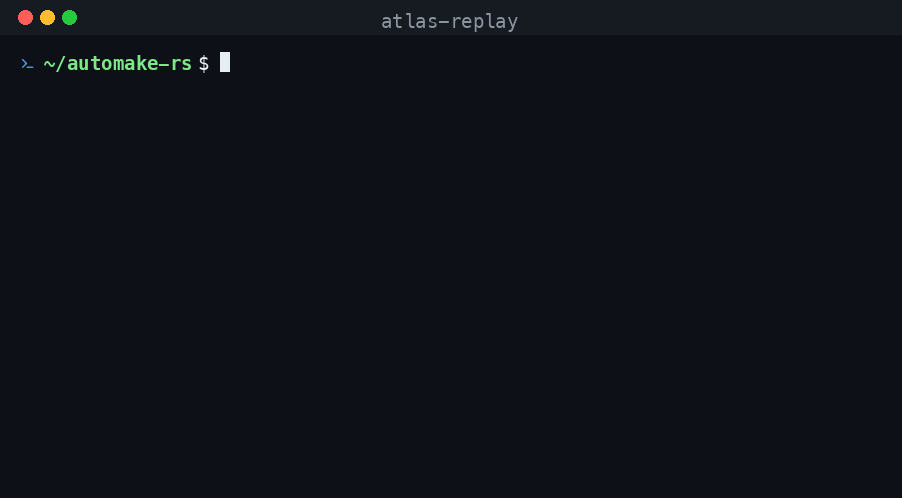

# automake-rs build-atlas

A **build-profiler atlas + build-court** (schema v2): every point in the build corpus is turned into a
reproducible, versioned recipe (`recipes/<owner>__<name>.json`). Each recipe pins the source (git SHA)
and the GNU-free toolchain, and records:

- **probe results** (config.h `HAVE_*`) and a **probe trace** with *why* each probe passed/failed
  (header-not-found / symbol-not-found / link-failed)
- the **dependency graph** (system libs / pkg-config / headers needed / missing) plus
  **missing-dep inference** (`suggested_deps`: failed probe → providing package)
- the **pass pipeline**, **target settings**, **quirks matched** and **quirks auto-applied**
  (a matched quirk applies a GNU-free fix, re-runs, and records whether it helped)
- the **verified outputs** (sha256) and a **sealed receipt** (court status + sha256 hash-chain)
- the **GNU-autotools oracle** result on the same repo, and a **classification** of the failure
- **deep expansion forensics** + the exact **syntax/macro context** to debug it

The point: a future build *reads the recipe* — installs the recorded deps, applies the known pipeline
and quirks, and reproduces the verified output. And the **oracle compass** turns the corpus into a
ranked fix-list: it knows which failures are *our bugs* (the real GNU toolchain succeeds where we don't)
versus *not standalone* (GNU fails too), so effort goes where it compounds.

## The compass (what makes success compound)

With `ATLAS_ORACLE=1`, each recipe is classified against the real GNU toolchain run on a git-reset copy:

| court_status | meaning |
| --- | --- |
| `sealed` | `FUNC_OK`, no quirks — fully reproduced, matches GNU |
| `quirk_dependent` | `FUNC_OK` but a quirk had to be applied |
| `partial` | configure cleared, make failed |
| `not_standalone` | the GNU oracle **also** fails — not our bug |
| `failed` | ours fails before make |

`recipes/INDEX.json` aggregates this into `oracle_compass` — `ours_configure_clear` vs
`real_configure_clear`, the `headroom_our_bugs` gap, and the `fixable_backlog_roots` /
`died_during_check` rankings — and `COURTS.md` is the human-readable gap analysis. That's the
ranked backlog: defeat the top root, the headroom shrinks, the next pass starts from rendered evidence.

## Notes

- **GNU-free**: only `autoreconf-rs` / `acrs-*` are invoked for the build; `toolchain.gnu_free: true`
  asserts no GNU autotools binary ran. The `oracle` block runs the real GNU toolchain **only for
  comparison**, on a separate git-reset tree — it never counts toward the build.
- **Schema**: see [SCHEMA.md](SCHEMA.md) (`automake-rs.build-atlas/v3`).
- **Regenerate**: `cargo xtask atlas <corpus-list> [out-dir]` — Rust only, no scripts
  (`xtask/src/atlas.rs`). `ATLAS_ORACLE=1` adds the oracle/court fields; `ATLAS_SCAN_ONLY=1` does a
  fast generate-only expansion sweep (no configure-run/make).
- **Query**: `cargo xtask atlas-query <term>` finds every recipe touching a dep / header / probe /
  package / quirk / macro.
- **Re-index**: `cargo xtask atlas-index <out-dir>` rebuilds `INDEX.json` + `COURTS.md` +
  `ANALYTICS.md` + `RECIPES.md` from existing recipes (no builds).
- **Replay**: `cargo xtask atlas-replay <recipe.json | owner/name | slug> [--keep]` reproduces a recipe
  in a clean dir and verifies it (see below).
- **Diff (A/B)**: `cargo xtask atlas-diff <baseline-dir> <experiment-dir>` compares two recipe sets by
  court verdict — flips (`failed → clear`), regressions (`clear → failed`), and net. This is how a
  corpus-wide toolchain change is gated: ship only if net-positive (see *Measured wins* below).

## Replay (`atlas-replay` — reproducer + regression gate)



Turns the atlas from a *record* into a *reproducer*. `atlas-replay <recipe.json>`:

1. clones the repo at the recipe's pinned `source.git_sha` into a clean dir (falls back to HEAD if the
   sha is gone, and records which it used),
2. re-applies the recorded pipeline — `autoreconf-rs -fi`, `./configure` with the recipe's
   `feature_flags.configure_args` + any `--flag` from `receipt.quirks_applied`, then `make`,
3. **verifies** the rebuilt artifacts' sha256 against the recipe's `outputs` (per-path match /
   hash-mismatch / missing),
4. emits a `automake-rs.replay-receipt/v1` receipt and **exits non-zero on anything but a clean
   reproduction** — so it gates regressions in CI.

`replay_status`: `reproduced` (all outputs match) · `reproduced_no_outputs` (built, recipe had no
artifacts) · `diverged` (built, but some output hashes differ — expected for non-reproducible binaries
that embed timestamps/paths) · `build_failed` · `clone_failed`.

### Usage

```sh
# by repo slug (resolved under atlas/recipes/), by owner/name, or by explicit path:
cargo xtask atlas-replay ayumin/open-cobol
cargo xtask atlas-replay ayumin__open-cobol
cargo xtask atlas-replay atlas/recipes/ayumin__open-cobol.json --keep   # --keep leaves the build dir

# same tool env as the atlas scan (GNU-free):
AUTOCONF_RS=… AUTOHEADER_RS=… ACLOCAL_RS=… AUTOMAKE_RS=… AUTORECONF_RS=… cargo xtask atlas-replay <repo>
```

Progress is logged to stderr; the machine-readable receipt goes to stdout (and a file). Exit code is
`0` only for a clean reproduction — so `atlas-replay` drops straight into CI as a regression gate.

### Demo (replaying `ayumin/open-cobol`)

```text
atlas-replay: recipe atlas/recipes/ayumin__open-cobol.json
  [1/5] clone https://github.com/ayumin/open-cobol ...
        clone: ok
  [2/5] checkout 72578e8fe3f1 (pinned)
  [3/5] autoreconf-rs -fi ...
        autoreconf: ok (configure generated)
  [4/5] ./configure  ...
        configure: ok
  [5/5] make -j2 ...
        make: ok
        verify: 6 matched, 4 hash-mismatch, 2 missing (of 12 recorded outputs)

atlas-replay: ayumin/open-cobol — diverged (receipt: /tmp/atlasreplay_ayumin__open-cobol/replay-receipt.json)
```

(`libcob.a` and `libcob.so.1.0.0` reproduce byte-for-byte; the mismatches are `tests/atconfig`, which
embeds the build path, and the `libcob.so` symlink — i.e. the non-deterministic artifacts, correctly
flagged.)

### Limitations

- **Non-reproducible binaries.** Most C toolchains embed timestamps / absolute paths / symlinks, so a
  byte-identical `reproduced` is the exception; `diverged` with a per-artifact breakdown is the norm and
  is the honest signal. Use the breakdown, not just the top-line status.
- **Network + toolchain required.** Replay clones from GitHub and needs a C compiler + make on `PATH`
  and the `*_RS` tools in the env (same as the scan).
- **Pinned-sha drift.** If the recorded `git_sha` is gone upstream, replay falls back to HEAD and records
  `pinned:false` — a `diverged`/`build_failed` from a HEAD fallback is *recipe rot*, not a real regression.
- **First-error diagnostics only.** A failed replay records the first hard error; deep triage still wants
  the recipe's `deep_expansion` / `divergence`.

## Analytics (`ANALYTICS.md` + `INDEX.json` → `analytics`)

Self-documenting corpus intelligence, regenerated on every index:

- **Quirk hotspots** — `quirks_matched` tallied across recipes; the most frequent are the
  highest-leverage to auto-apply (the automation backlog).
- **Top failure roots** — the `checking for …` the build actually died on, ranked by repos.
- **Dependency patterns** — most-needed headers / most-missing deps.
- **Heavy hitters** — configure size as a complexity proxy (also surfaces runaway-expansion bugs).
- **Partial → full shortlist** — recipes that cleared configure but failed make, and how many are
  `OURS_BUG_MAKE` (GNU makes it, we don't) — the closest wins, with their top blockers.

## Measured wins (how the corpus drives the toolchain)

The atlas is not just a record — it's the feedback loop that fixes `autoconf-rs`/`automake-rs`. Each
toolchain fix is gated by a before/after re-scan diffed with `atlas-diff`; a change ships only if it's
net-positive with no regressions. The configure-clear count across the 982-recipe corpus:

| toolchain | configure-clear | what changed |
| --- | --- | --- |
| early | 136 | pre-campaign |
| autoconf-rs 0.1.12–0.1.15 | 333 | targeted leaked-macro roots: `AC_CHECK_DECL` cluster, `AC_ERROR`/`AC_LANG_CONFTEST`, native `AX_PTHREAD`, C-feature leaked-text overrides |
| **autoconf-rs 0.1.16** | **368** | **leaked-macro *neutralizer*** — a systemic pass that collapses any unknown autoconf-family macro (`AC_`/`AX_`/`AM_`/`LT_`/`m4_`…) leaking into the generated shell to a `:` no-op, so configure continues instead of dying |

The neutralizer is the systemic class-fix: where the per-macro grind moved a handful of repos each, one
pass measured **+35 `failed → configure-clear` with 0 regressions** (via `atlas-diff` on the 489 failed/
partial repos). It's ON by default in 0.1.16; opt out with `AUTOCONF_RS_NO_NEUTRALIZE=1`. Real shell
(`$( )`/`$(( ))`/subshells) and non-autoconf identifiers are left untouched.

Remaining headroom is the **make layer** — `partial` recipes that clear configure but fail `make` (the
`partial → full` shortlist above) — a different engine (Makefile/dependency generation), the next front.
